# Jetson_dli_PSY

``` bash
hello
<b>
# hello
## hello
### hello
```
# 11월 7일 수업내용 : JetsonNano 환경구축
## 0. 사전 수업 준비 내용
(1) jetpack 4.6.1 를 다운로드 한다.
(2) sd card formatter 프로그램을 다운받는다.
(3) balena etcher를 사용해 이미지를 굽기 위해서 준비한다.
(4) uSD에 Jetpack 4.6 burning (GUI 이미지 굽기를 진행한다) = SD card format download formatting 한다. 


## 1. JetsonNano는 무엇인가?
### Jetson Nano 구조 설명

1. **microSD 카드 슬롯 (주 저장소)**  
   Jetson Nano는 microSD 카드를 사용하여 운영 체제 및 파일 저장소를 제공합니다. 이 슬롯에 microSD 카드를 삽입하여 기본 저장소로 사용할 수 있습니다.

2. **40핀 확장 헤더**  
   40핀 GPIO 헤더는 외부 장치와의 연결을 위해 다양한 핀을 제공합니다. 이를 통해 센서, 모터 및 기타 외부 장치를 연결할 수 있습니다.

3. **Micro-USB 포트 (5V 전원 입력, 또는 디바이스 모드용)**  
   Micro-USB 포트는 Jetson Nano에 전원을 공급하는데 사용되며, 디바이스 모드로 연결할 때도 사용될 수 있습니다. 5V 전원 입력을 위한 중요한 포트입니다.

4. **기가비트 이더넷 포트**  
   기가비트 이더넷 포트는 빠르고 안정적인 유선 네트워크 연결을 제공합니다. 이를 통해 인터넷에 연결하거나 로컬 네트워크에서 데이터를 송수신할 수 있습니다.

5. **USB 3.0 포트 (x4)**  
   총 4개의 USB 3.0 포트를 통해 외부 장치를 연결할 수 있습니다. 이를 통해 키보드, 마우스, USB 드라이브 등 다양한 USB 장치를 사용할 수 있습니다.

6. **HDMI 출력 포트**  
   HDMI 포트를 통해 모니터나 TV에 Jetson Nano의 화면을 출력할 수 있습니다. 고화질 비디오 및 오디오 신호를 전송합니다.

7. **DisplayPort 커넥터**  
   DisplayPort 커넥터를 사용하여 더 높은 해상도 및 주사율을 지원하는 디스플레이 장치에 연결할 수 있습니다.

8. **DC Barrel 잭 (5V 전원 입력)**  
   DC Barrel 잭을 사용하여 Jetson Nano에 5V 전원을 공급할 수 있습니다. 전원 어댑터를 연결하여 안정적인 전원 공급을 보장합니다.

9. **MIPI CSI-2 카메라 커넥터**  
   MIPI CSI-2 (Camera Serial Interface 2) 커넥터를 통해 카메라 모듈을 연결할 수 있습니다. 이 커넥터는 고속 데이터 전송을 지원하여 비디오 스트리밍 및 이미지 캡처에 유용합니다.

   

## 2. Initial Setup
### Jetson Nano 우분투 설치 가이드
Jetson Nano는 NVIDIA에서 제공하는 소형 컴퓨터로, AI 및 딥러닝 프로젝트에 많이 사용됩니다. Jetson Nano에 우분투를 설치하는 방법은 아래와 같습니다.

1. **Jetson Nano 이미지 다운로드**
- 우선, Jetson Nano에 맞는 우분투 이미지를 다운로드합니다.
- [NVIDIA 공식 웹사이트](https://developer.nvidia.com/embedded/jetpack)에서 Jetson Nano용 JetPack SDK 이미지를 다운로드할 수 있습니다.

2. **부팅 가능한 microSD 카드 준비**
- 우분투 이미지를 microSD 카드에 기록하려면 `balenaEtcher` 또는 `dd`와 같은 툴을 사용하여 다운로드한 이미지를 microSD 카드에 플래시합니다.
  - **balenaEtcher 사용 방법**:
    1. `balenaEtcher`를 설치합니다.
    2. 다운로드한 Jetson Nano 이미지를 선택하고, microSD 카드를 선택하여 플래시합니다.

3. **Jetson Nano에 microSD 카드 삽입**
- 이미지를 플래시한 microSD 카드를 Jetson Nano의 microSD 슬롯에 삽입합니다.

4. **모니터, 키보드, 마우스 연결**
- Jetson Nano에 HDMI 케이블을 사용해 모니터를 연결하고, USB 포트를 사용하여 키보드와 마우스를 연결합니다.
  

5. **전원 공급**
- Jetson Nano는 `5V 4A` 이상의 전원 어댑터를 사용하여 전원을 공급해야 합니다. DC Barrel Jack 또는 Micro-USB 포트를 통해 전원을 연결합니다. (참고로 USB 2층 가장 우측이 잘 작동되는 자리이다.)

6. **첫 부팅**
- 전원 공급 후 Jetson Nano를 부팅하면 우분투 시스템이 자동으로 초기화됩니다.
- 첫 부팅 시, 화면에 안내에 따라 언어 설정, 네트워크 설정 등을 진행합니다.
- 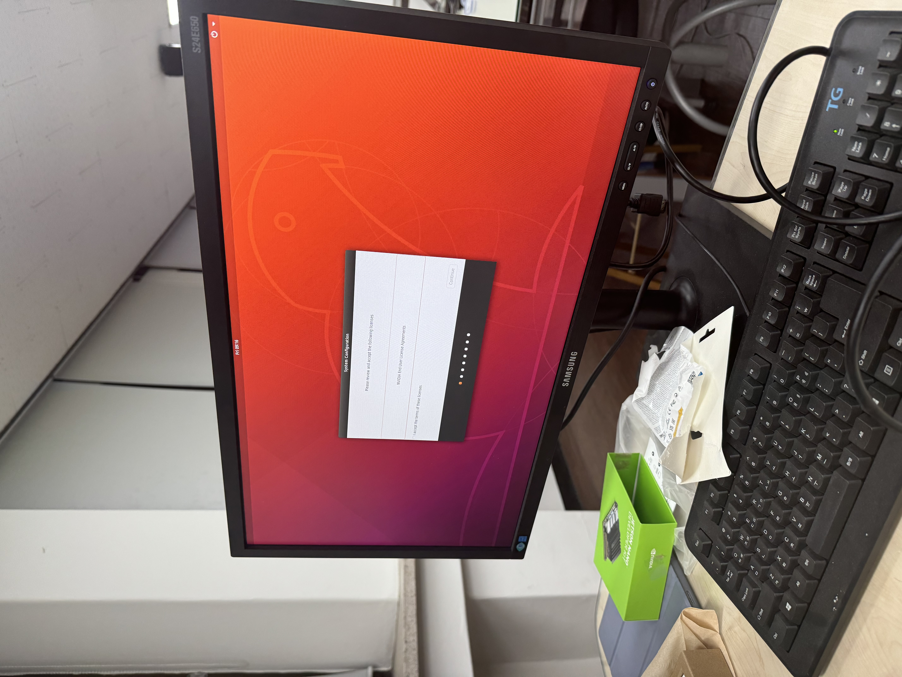
- 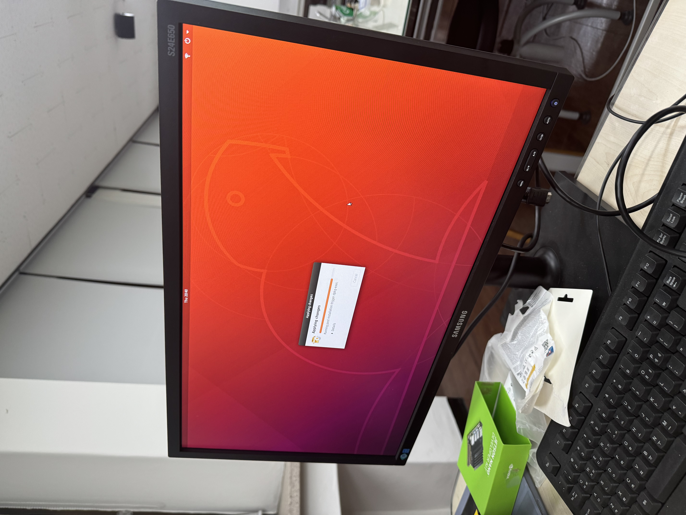

7. **Jetson Nano에 우분투 설정 완료**
- 설치가 완료되면 Jetson Nano에 우분투가 설치된 상태에서 사용할 수 있습니다.
- 필요에 따라 **JetPack**을 설치하여 추가적인 소프트웨어 및 라이브러리를 설정할 수 있습니다.
- 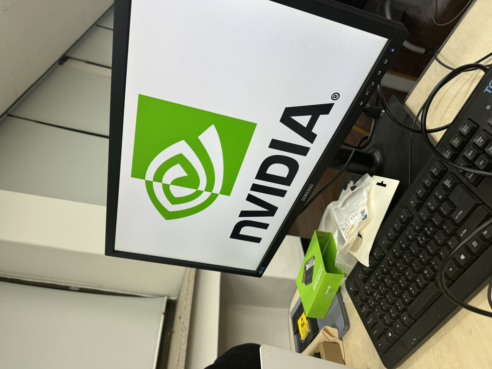

8. **네트워크 연결**
- Wi-Fi나 유선 네트워크를 통해 Jetson Nano를 인터넷에 연결하여 소프트웨어를 업데이트하고 필요한 패키지를 설치합니다.

**실행해야 할 명령**

```bash
# Wi-Fi 네트워크 목록 확인
sudo nmcli device wifi list

# Wi-Fi 네트워크에 연결 (패스워드가 있을 경우)
sudo nmcli device wifi connect <ssid_name> password <password>
```
**user: dcrc , password: 1234** 로 설정하였으니 잊으면 안된다. 

9. **필수 소프트웨어 설치**
- AI 프로젝트에 필요한 패키지나 라이브러리(NVIDIA CUDA, cuDNN 등)를 Jetson Nano에 설치할 수 있습니다.


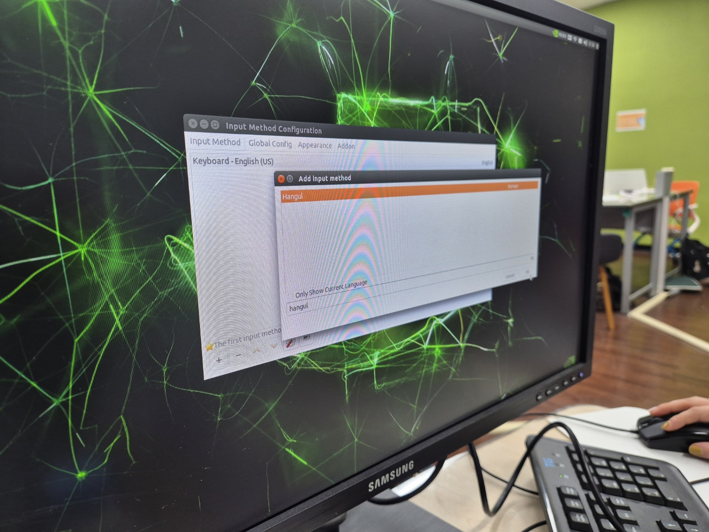
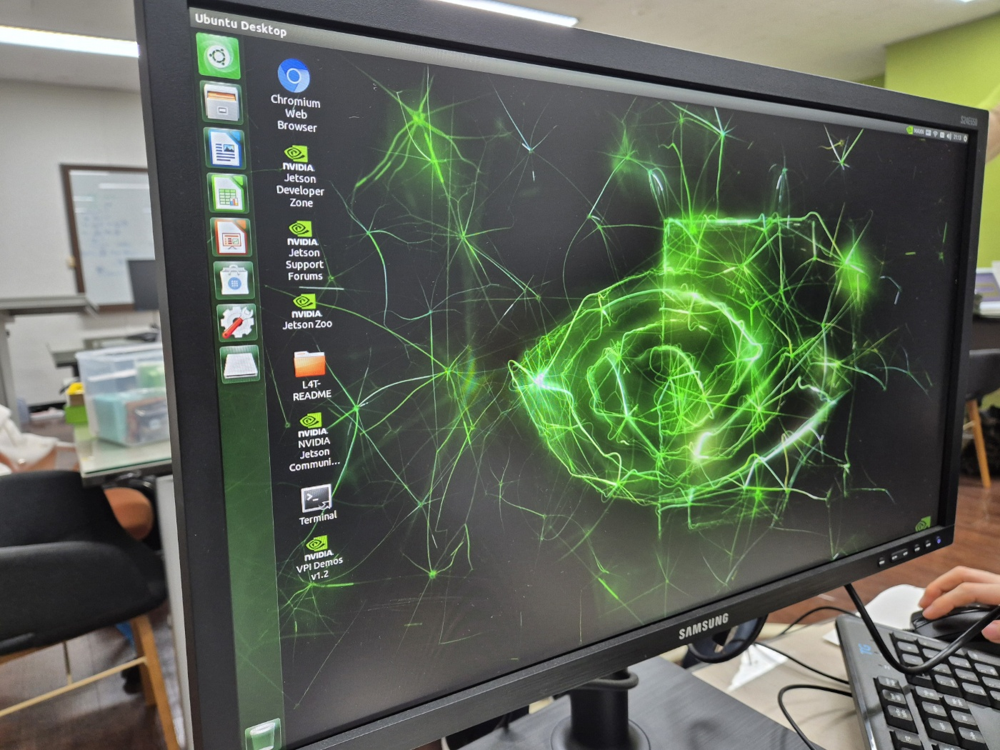

### Hangul 설치
[한글 설치 관련 참고](https://driz2le.tistory.com/253)

1. **한글 입력기 설치**
먼저, 시스템 패키지 목록을 업데이트하고 `fcitx-hangul` 패키지를 설치해야 합니다.
터미널에 아래 명령어를 입력하세요:

```bash
sudo apt-get update
sudo apt-get install fcitx-hangul
```

이후, im-config 명령어로 입력기를 fcitx로 설정한다. 
마지막으로, 시스템을 재부팅까지 한다. 
```bash
im-config -n fcitx
reboot
```
한글이 잘 설치되면 한영키 클릭 시 아래와 같이 키보드 아이콘이 바뀌는 것을 볼 수 있다. 
(한글 아이콘이 뜨는 이미지 넣기)


# 11월 14일 수업내용 : 이미지, 동영상 만들기

## 1. 쿨링팬과 jtop
1.**Jetson Nano에서 jtop 사용법**

`jtop`은 Jetson 플랫폼에서 시스템 자원 사용 현황을 모니터링할 수 있는 도구입니다. 이는 **GPU**, **CPU**, **메모리**, **디스크**, **네트워크** 등의 사용 상태를 실시간으로 확인할 수 있게 도와줍니다. `jtop`은 Jetson Nano의 성능을 최적화하고 모니터링할 때 유용한 도구입니다.

2. **jtop 설치 방법**

`jtop`을 설치하려면 터미널에 아래 명령어를 입력합니다:

```bash
sudo apt install python3-pip
```
terminal에서 명령을 실행하면 컴퓨터가 물어본다. 
''**do you want to continue?**'' 
Y를 입력해 계속 진행하면 된다.

```bash
sudo pip3 install jetson-stats
```
**에러 해결 방법**
만약 에러가 발생하면, 아래 명령어로 시스템을 업데이트하고 업그레이드합니다.

```bash
sudo apt-get update
sudo apt-get upgrade
```
그리고 jetson-stats-4.2.3 버전이 제대로 설치되었는지 확인합니다.

**시스템 재부팅 및 jtop 실행**

시스템을 재부팅하려면 아래 명령어를 입력합니다:

```bash
reboot
```
재부팅 후에는 jtop을 실행하여 시스템 상태를 모니터링하면 됩니다.

'''bash
jtop
```
온도체크를 하면 된다. 온도가 무척 높아지기 때문에 쿨링팬을 설치한다.

** 터미널 명령어 실행 ** 

터미널을 열고 아래 명령어를 입력하여 실행합니다:

```bash
sudo sh -c 'echo 128 > /sys/devices/pwm-fan/target_pwm'
```
나의 사본 56페이지까지 정리함

1.8.19
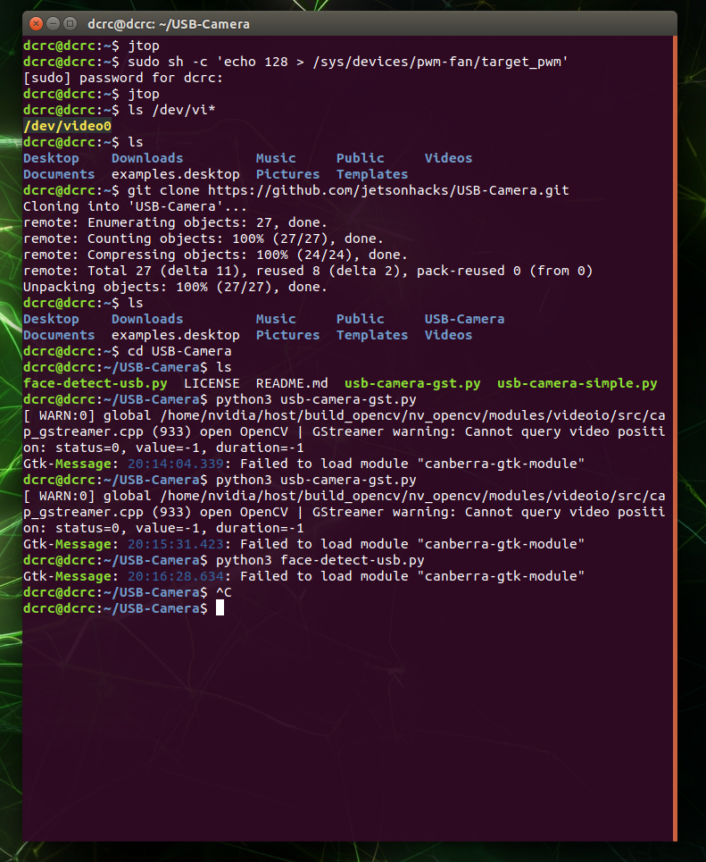
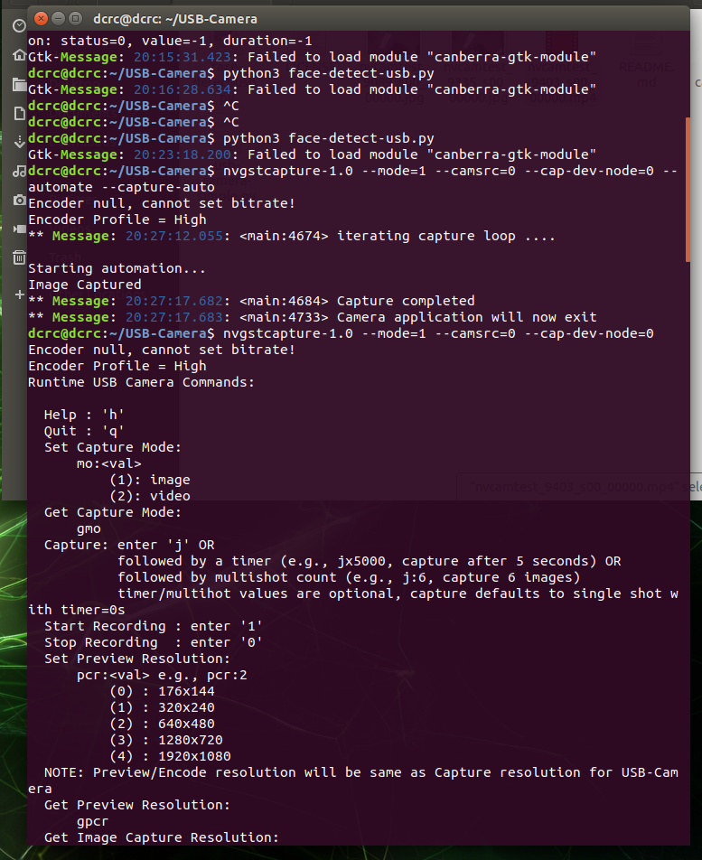
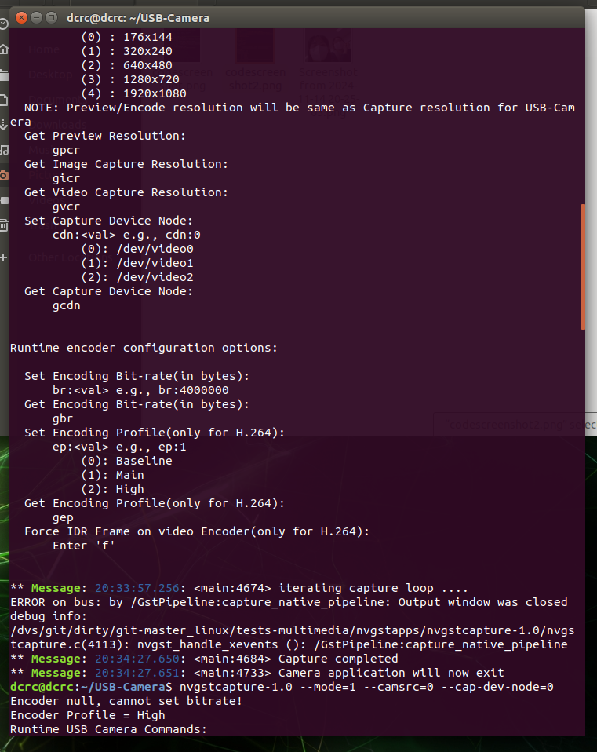
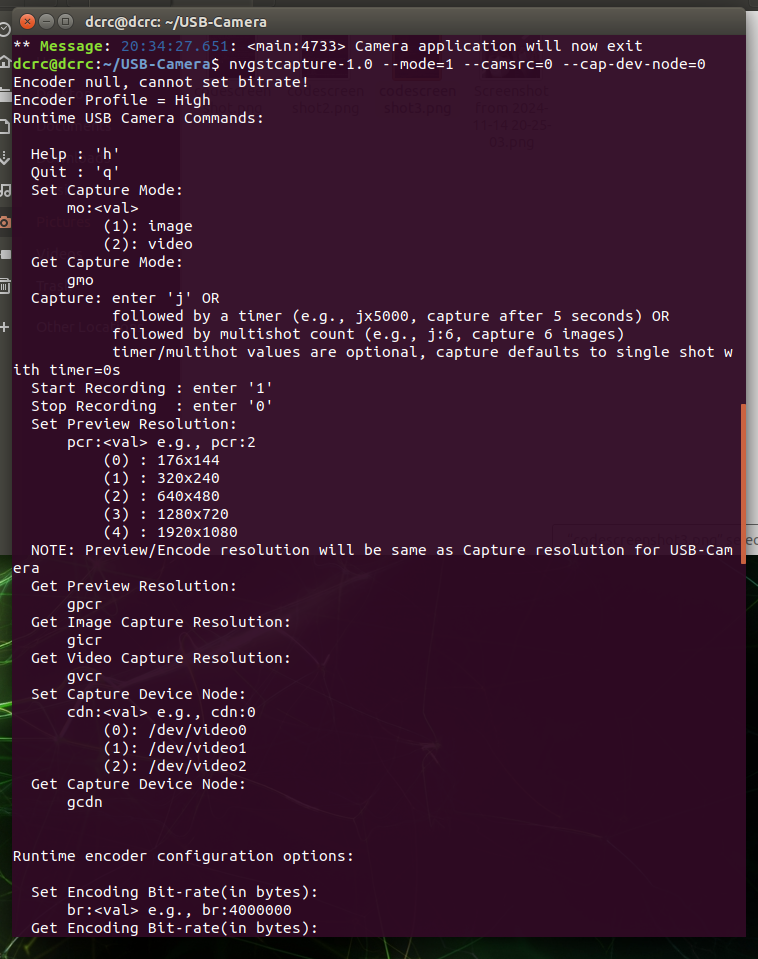
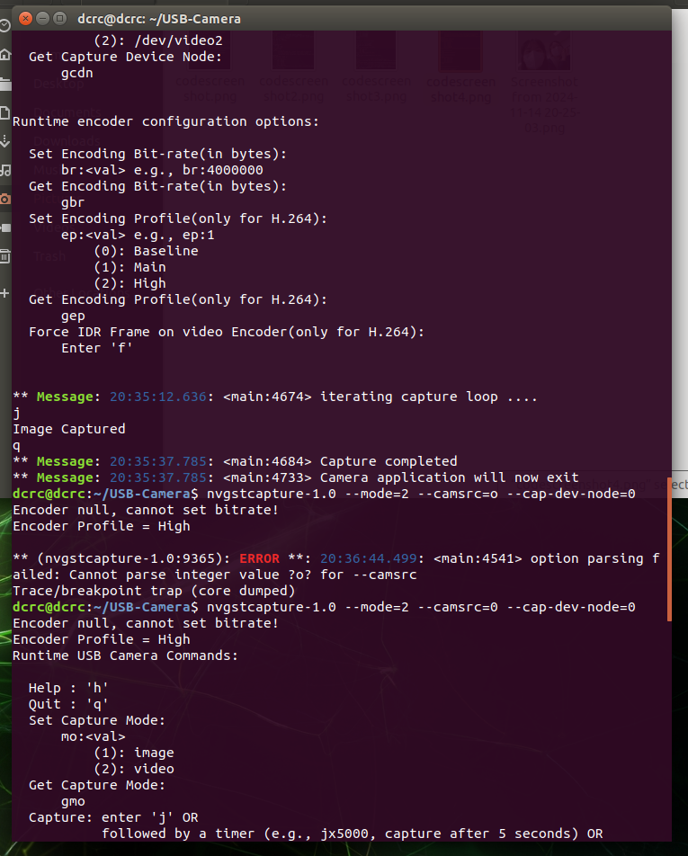
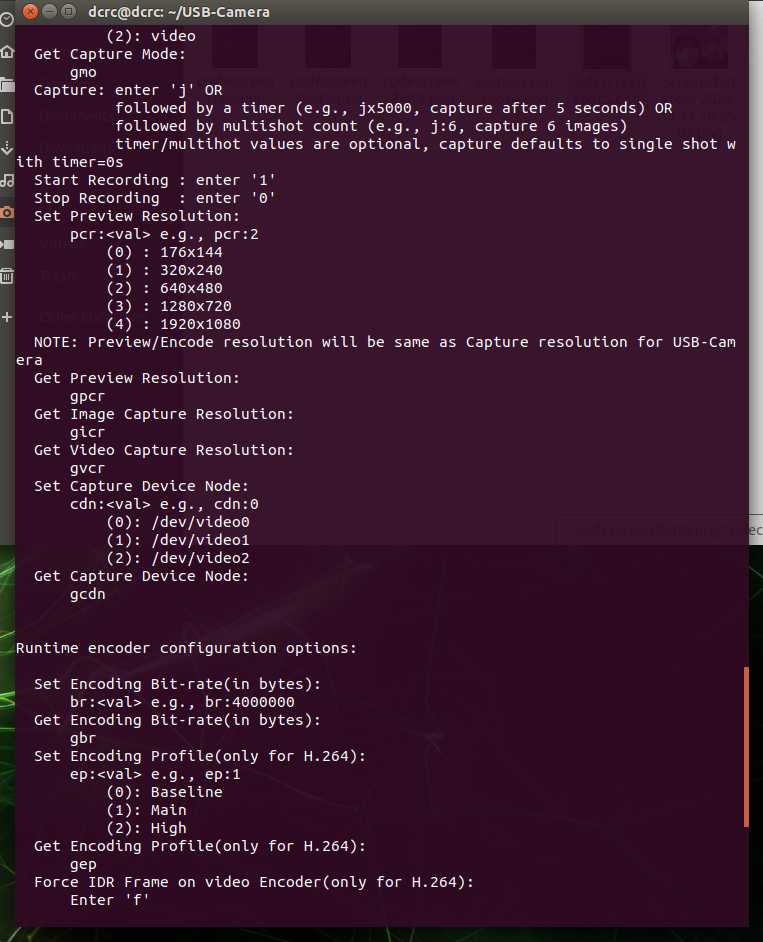
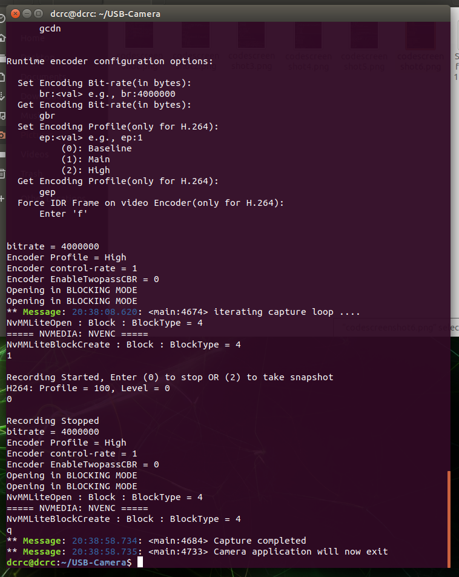
