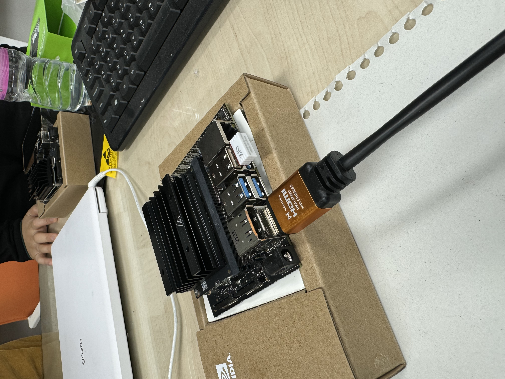

# Jetson_dli_PSY

``` bash
hello
<b>
# hello
## hello
### hello
```
# 11월 7일 수업내용 : JetsonNano 환경구축
## 0. 사전 수업 준비 내용
(1) jetpack 4.6.1 를 다운로드 한다.
(2) sd card formatter 프로그램을 다운받는다.
(3) balena etcher를 사용해 이미지를 굽기 위해서 준비한다.
(4) uSD에 Jetpack 4.6 burning (GUI 이미지 굽기를 진행한다) = SD card format download formatting 한다. 


## 1. JetsonNano는 무엇인가?
### Jetson Nano 구조 설명

1. **microSD 카드 슬롯 (주 저장소)**  
   Jetson Nano는 microSD 카드를 사용하여 운영 체제 및 파일 저장소를 제공합니다. 이 슬롯에 microSD 카드를 삽입하여 기본 저장소로 사용할 수 있습니다.

2. **40핀 확장 헤더**  
   40핀 GPIO 헤더는 외부 장치와의 연결을 위해 다양한 핀을 제공합니다. 이를 통해 센서, 모터 및 기타 외부 장치를 연결할 수 있습니다.

3. **Micro-USB 포트 (5V 전원 입력, 또는 디바이스 모드용)**  
   Micro-USB 포트는 Jetson Nano에 전원을 공급하는데 사용되며, 디바이스 모드로 연결할 때도 사용될 수 있습니다. 5V 전원 입력을 위한 중요한 포트입니다.

4. **기가비트 이더넷 포트**  
   기가비트 이더넷 포트는 빠르고 안정적인 유선 네트워크 연결을 제공합니다. 이를 통해 인터넷에 연결하거나 로컬 네트워크에서 데이터를 송수신할 수 있습니다.

5. **USB 3.0 포트 (x4)**  
   총 4개의 USB 3.0 포트를 통해 외부 장치를 연결할 수 있습니다. 이를 통해 키보드, 마우스, USB 드라이브 등 다양한 USB 장치를 사용할 수 있습니다.

6. **HDMI 출력 포트**  
   HDMI 포트를 통해 모니터나 TV에 Jetson Nano의 화면을 출력할 수 있습니다. 고화질 비디오 및 오디오 신호를 전송합니다.

7. **DisplayPort 커넥터**  
   DisplayPort 커넥터를 사용하여 더 높은 해상도 및 주사율을 지원하는 디스플레이 장치에 연결할 수 있습니다.

8. **DC Barrel 잭 (5V 전원 입력)**  
   DC Barrel 잭을 사용하여 Jetson Nano에 5V 전원을 공급할 수 있습니다. 전원 어댑터를 연결하여 안정적인 전원 공급을 보장합니다.

9. **MIPI CSI-2 카메라 커넥터**  
   MIPI CSI-2 (Camera Serial Interface 2) 커넥터를 통해 카메라 모듈을 연결할 수 있습니다. 이 커넥터는 고속 데이터 전송을 지원하여 비디오 스트리밍 및 이미지 캡처에 유용합니다.

   

## 2. Initial Setup
### Jetson Nano 우분투 설치 가이드
Jetson Nano는 NVIDIA에서 제공하는 소형 컴퓨터로, AI 및 딥러닝 프로젝트에 많이 사용됩니다. Jetson Nano에 우분투를 설치하는 방법은 아래와 같습니다.

1. **Jetson Nano 이미지 다운로드**
- 우선, Jetson Nano에 맞는 우분투 이미지를 다운로드합니다.
- [NVIDIA 공식 웹사이트](https://developer.nvidia.com/embedded/jetpack)에서 Jetson Nano용 JetPack SDK 이미지를 다운로드할 수 있습니다.

2. **부팅 가능한 microSD 카드 준비**
- 우분투 이미지를 microSD 카드에 기록하려면 `balenaEtcher` 또는 `dd`와 같은 툴을 사용하여 다운로드한 이미지를 microSD 카드에 플래시합니다.
  - **balenaEtcher 사용 방법**:
    1. `balenaEtcher`를 설치합니다.
    2. 다운로드한 Jetson Nano 이미지를 선택하고, microSD 카드를 선택하여 플래시합니다.

3. **Jetson Nano에 microSD 카드 삽입**
- 이미지를 플래시한 microSD 카드를 Jetson Nano의 microSD 슬롯에 삽입합니다.

4. **모니터, 키보드, 마우스 연결**
- Jetson Nano에 HDMI 케이블을 사용해 모니터를 연결하고, USB 포트를 사용하여 키보드와 마우스를 연결합니다.
  

5. **전원 공급**
- Jetson Nano는 `5V 4A` 이상의 전원 어댑터를 사용하여 전원을 공급해야 합니다. DC Barrel Jack 또는 Micro-USB 포트를 통해 전원을 연결합니다. (참고로 USB 2층 가장 우측이 잘 작동되는 자리이다.)

6. **첫 부팅**
- 전원 공급 후 Jetson Nano를 부팅하면 우분투 시스템이 자동으로 초기화됩니다.
- 첫 부팅 시, 화면에 안내에 따라 언어 설정, 네트워크 설정 등을 진행합니다.
- 
- 

7. **Jetson Nano에 우분투 설정 완료**
- 설치가 완료되면 Jetson Nano에 우분투가 설치된 상태에서 사용할 수 있습니다.
- 필요에 따라 **JetPack**을 설치하여 추가적인 소프트웨어 및 라이브러리를 설정할 수 있습니다.
- 

8. **네트워크 연결**
- Wi-Fi나 유선 네트워크를 통해 Jetson Nano를 인터넷에 연결하여 소프트웨어를 업데이트하고 필요한 패키지를 설치합니다.

**실행해야 할 명령**

```bash
# Wi-Fi 네트워크 목록 확인
sudo nmcli device wifi list

# Wi-Fi 네트워크에 연결 (패스워드가 있을 경우)
sudo nmcli device wifi connect <ssid_name> password <password>
```
**user: dcrc , password: 1234** 로 설정하였으니 잊으면 안된다. 

9. **필수 소프트웨어 설치**
- AI 프로젝트에 필요한 패키지나 라이브러리(NVIDIA CUDA, cuDNN 등)를 Jetson Nano에 설치할 수 있습니다.


### Hangul 설치
[한글 설치 관련 참고](https://driz2le.tistory.com/253)

1. **한글 입력기 설치**
먼저, 시스템 패키지 목록을 업데이트하고 `fcitx-hangul` 패키지를 설치해야 합니다.
터미널에 아래 명령어를 입력하세요:

```bash
sudo apt-get update
sudo apt-get install fcitx-hangul
```

이후, im-config 명령어로 입력기를 fcitx로 설정한다. 
마지막으로, 시스템을 재부팅까지 한다. 
```bash
im-config -n fcitx
reboot
```
한글이 잘 설치되면 한영키 클릭 시 아래와 같이 키보드 아이콘이 바뀌는 것을 볼 수 있다. 
(한글 아이콘이 뜨는 이미지 넣기)


# 11월 14일 수업내용 : 이미지, 동영상 만들기

## 1. 쿨링팬과 jtop
1.**Jetson Nano에서 jtop 사용법**

`jtop`은 Jetson 플랫폼에서 시스템 자원 사용 현황을 모니터링할 수 있는 도구입니다. 이는 **GPU**, **CPU**, **메모리**, **디스크**, **네트워크** 등의 사용 상태를 실시간으로 확인할 수 있게 도와줍니다. `jtop`은 Jetson Nano의 성능을 최적화하고 모니터링할 때 유용한 도구입니다.

2. **jtop 설치 방법**

`jtop`을 설치하려면 터미널에 아래 명령어를 입력합니다:

```bash
sudo apt install python3-pip
```
terminal에서 명령을 실행하면 컴퓨터가 물어본다. 
''**do you want to continue?**'' 
Y를 입력해 계속 진행하면 된다.

```bash
sudo pip3 install jetson-stats
```
**에러 해결 방법**
만약 에러가 발생하면, 아래 명령어로 시스템을 업데이트하고 업그레이드합니다.

```bash
sudo apt-get update
sudo apt-get upgrade
```
그리고 jetson-stats-4.2.3 버전이 제대로 설치되었는지 확인합니다.

3. **시스템 재부팅 및 jtop 실행**

시스템을 재부팅하려면 아래 명령어를 입력합니다:

```bash
reboot
```
재부팅 후에는 jtop을 실행하여 시스템 상태를 모니터링하면 됩니다.

```bash
jtop
```
온도체크를 하면 된다. 온도가 무척 높아지기 때문에 쿨링팬을 설치한다.

4. **터미널 명령어 실행** 

터미널을 열고 아래 명령어를 입력하여 실행합니다:

```bash
sudo sh -c 'echo 128 > /sys/devices/pwm-fan/target_pwm'
```
## 2. 카메라

1. **카메라 인식**
```bash
ls /dev/vi*
```
이 코드는 제슨이 카메라 인식을 하는 지 확인하는 명령어입니다. 

2. **USB-Camera 파일**
```bash
git clone https://github.com/jetsonhacks/USB-Camera.git
```
위 명령어는 USB-Camera라는 리포지토리를 Jetson 로컬 환경으로 복제(clone)합니다. 성공 시, 리포지토리 내 모든 파일이 USB-Camera라는 디렉토리에 다운로드됩니다.

```bash
ls
```
ls 명령어는 현재 디렉토리에 있는 폴더 및 파일 목록을 표시합니다.
위 명령어 실행 후, 다음과 같은 항목들이 표시됩니다: Desktop, Downloads, Pictures, USB-Camera 등.

```bash
cd USB-Camera
```
cd 명령어는 지정된 디렉토리로 이동합니다.
위 명령어 실행 후, 현재 작업 디렉토리는 USB-Camera로 변경됩니다.

3. **Jetson에서 사용 가능한 카메라 종류**

(1) USB 카메라
   - **연결 방식**: USB 포트를 통해 연결
   - **특징**:
     - 플러그 앤 플레이 (대부분 드라이버 필요 없음)
     - 다양한 기기에서 사용 가능
     - 상대적으로 느린 속도와 높은 지연 시간

(2) CSI(Camera Serial Interface) 카메라
   - **연결 방식**: CSI 포트를 통해 리본 케이블로 연결
   - **특징**:
     - Jetson 전용으로 최적화
     - 고속 데이터 전송 및 낮은 지연 시간
     - NVIDIA IMX219 카메라 모듈 등 지원

4. **GStreamer를 활용한 카메라 실행**
```bash
python3 usb-camera-gst.py
```
usb-camera-gst.py: OpenCV와 GStreamer를 사용해 USB 카메라를 실행하는 Python 스크립트입니다.

```bash
[ WARN:0] ... GStreamer warning: Cannot query video position ...
```
이 경고는 GStreamer 초기화 과정에서 나타나는 일반적인 메시지이며, 실행에는 영향을 미치지 않습니다.

5. **얼굴 검출 스크립트 실행 과정**
```bash
   python3 face-detect-usb.py
```
이 스크립트는 USB 카메라로 입력된 영상을 사용하여 얼굴을 검출합니다.
OpenCV를 활용하여 실시간으로 얼굴을 인식합니다. 실행 시, USB 카메라의 영상 스트림이 열리며 얼굴을 감지하고, 감지된 영역에 사각형을 그려 표시합니다. 성공적으로 실행되면 카메라 창이 열리고, 검출 결과가 실시간으로 표시됩니다.

**(참고사항)**
스크립트를 실행하기 전, USB 카메라가 제대로 연결되었는지 확인하세요.
필요 시 OpenCV가 설치되어 있어야 하므로, 설치되지 않았다면 다음 명령어로 설치합니다

```bash
pip install opencv-python
pip install opencv-python-headless
```
**(경고메시지)**
```bash
[ WARN:0] ... GStreamer warning: Cannot query video position ...
```
이는 정상적인 초기화 과정에서 나타나는 일반적인 경고로, 실행에는 영향을 미치지 않습니다.

6. **이미지 capture**

(1) 이미지 캡처 명령어 실행
```bash
nvgstcapture-1.0 --camsrc=0 --cap-dev-node=/dev/video0
```
nvgstcapture-1.0: NVIDIA GStreamer 기반의 이미지 및 영상 캡처 도구이다.

옵션 설명:
--camsrc=0: 기본 카메라(0번 카메라)를 소스로 지정.
--cap-dev-node=/dev/video0: /dev/video0 디바이스(카메라) 노드를 사용.

(2) 실행 중 메시지
실행 중 다음과 같은 메시지가 나타날 수 있습니다:
```bash
** Message: 19:50:52.158: <main:4648> iterating capture loop ....
```
이는 캡처 루프가 실행 중이라는 의미입니다.

(3) 이미지 캡처
캡처 버튼을 클릭하면 Image Captured 메시지가 표시되고, 이미지가 저장됩니다.

(4) 저장된 이미지 확인
저장된 이미지 파일은 홈 디렉토리 내 Pictures 폴더에 저장됩니다.
예: Pictures/IMAGE_0000.jpg

(5) 참고사항
이미지를 성공적으로 캡처하려면 카메라가 정상적으로 연결되어 있어야 합니다.
저장된 파일은 기본적으로 .jpg 형식이며, 파일명은 IMAGE_XXXX.jpg 형식으로 자동 생성됩니다.

7. **자동 이미지 캡처 과정**
(1) 자동 이미지 명령어 입력
```bash
nvgstcapture-1.0 --mode=1 --camsrc=0 --cap-dev-node=0 --automate --capture-auto
```
**옵션 설명:**
--mode=1: 스틸 이미지 캡처 모드.
--camsrc=0: 기본 카메라(0번 카메라)를 사용.
--cap-dev-node=0: /dev/video0 디바이스 노드를 지정.
--automate: 자동화된 캡처 실행.
--capture-auto: 자동 캡처 실행 옵션

(2) 실행 중 메시지
```bash
Encoder null, cannot set bitrate!
Encoder Profile = High
** Message: <main:4674> iterating capture loop ....
```
일부 메시지(Encoder null)는 무시해도 됩니다. 이는 실행에는 영향을 미치지 않습니다. 

(3) 자동 캡처 완료
캡처 과정이 완료되면 다음과 같은 메시지가 표시됩니다.

```bash
Image Captured
** Message: Capture completed
** Message: Camera application will now exit
```

8. **이미지 캡처 간단 설명**
   
(1) **명령어 실행**
```bash
nvgstcapture-1.0 --mode=1 --camsrc=0 --cap-dev-node=0
```
카메라에서 실시간 이미지를 표시.

(2) **이미지 캡처**
마우스를 클릭하여 이미지를 캡처.
캡처 완료 후 Pictures 폴더에 저장 (IMAGE_0000.jpg 등).

(3) **메시지 확인**
```bash
** Message: iterating capture loop ....
Image Captured
Capture completed
```
9. **영상 만들기**
(1) **명령어 실행**
```bash
nvgstcapture-1.0 --mode=2 --camsrc=0 --cap-dev-node=0
```
옵션 설명:
--mode=2: 영상 캡처 모드.
--camsrc=0: 기본 카메라(0번) 사용.
--cap-dev-node=0: /dev/video0 사용.

(2) **실행결과 및 조작 방법**
실행 시 다음과 같은 메시지가 표시된다.
```
Press '1' to start recording video
Press '0' to stop recording video
Press '2' to take a snapshot
```
조작 방법: '1' 영상 녹화 시작, '0' 녹화 중지, '2' 스냅샷 캡처

(3) **저장 결과**
녹화된 영상과 스냅샷은 Pictures 폴더에 저장됩니다.
파일명: VIDEO_XXXX.mp4, IMAGE_XXXX.jpg

### 아래는 11월 14일 수업에서 실행한 Terminal을 캡처한 화면


# 11월 21일 수업내용
## 1. 실습 전 할일 DLI docker 설치
1. **DLI docker**
* DLI docker이미지를 설치.
* 카메라 동작까지 확인합니다. 

2. **Headless 모드로 동작**
Jetson Nano의 **헤드리스 모드**란, 모니터나 키보드 없이 Jetson을 사용할 수 있는 모드를 의미합니다. 이 모드에서는 GUI(그래픽 사용자 인터페이스)가 없으며, 화면은 검정색으로 표시됩니다. Jetson Nano를 처음 부팅할 때 스크립트를 통해 사용자 이름, 암호, 언어, 시간대 등을 설정할 수 있습니다. 헤드리스 모드는 주로 네트워크를 통해 Jetson을 원격으로 제어할 때 사용됩니다.

3. **L4T**
마이크로 5핀을 제슨나노와 데스크탑에 연결하면 컴퓨터 오른쪽 하단에 L4T라는 글이 써진다. 연결이 되었다는 의미이다. 이 글이 꼭 나와야한다.

4. **dir 추가하기**
디렉토리를 생성한다
```bash
mkdir -p ~/nvdli-data
ls
```
ls를 통해 생성된 nvdli-data 디렉토리를 포함한 파일 및 폴더 목록이 출력되는지 확인한다. 

5. **Docker 명령어**
```bash
sudo docker run --runtime nvidia -it --rm --network host \
    --memory=500M --memory-swap=4G \
    --volume ~/nvdli-data:/nvdli-nano/data \
    --volume /tmp/argus_socket:/tmp/argus_socket \
    --device /dev/video0 \
    nvcr.io/nvidia/dli/dli-nano-ai:v2.0.2-r32.7.1kr
```
실행 결과
* NVIDIA DLI의 Nano AI 환경이 설정된 Docker 컨테이너가 실행됩니다.
* 컨테이너 내에서 머신 러닝 및 AI 관련 작업을 수행할 수 있습니다.

```bash
  chmod +x docker_dli_run.sh
```
`chmod +x docker_dli_run.sh` 명령어는 **`docker_dli_run.sh` 스크립트 파일에 실행 권한을 부여**합니다.

* `chmod`: 파일의 권한을 변경하는 명령어.
* `+x`: 실행 권한을 추가하는 옵션.
* `docker_dli_run.sh`: 실행 권한을 부여할 대상 파일.

이 명령어를 실행하면, `docker_dli_run.sh` 파일을 실행 가능한 프로그램처럼 사용할 수 있습니다. 이후에는 `./docker_dli_run.sh` 명령으로 파일을 실행할 수 있습니다. 그리고 ls를 통해 파일을 확인한다. 

```bash
[sudo] password for dli:
```
이러한 명령어가 나오면 사용자명과 비밀번호를 입력한다. 

6. **Docker 컨테이너 실행 후 상태 설명**

1. 다운로드 상태
- Docker가 필요한 이미지를 다운로드하고 실행 준비를 완료한 상태입니다.
- 메시지:
- - 모든 이미지 레이어가 성공적으로 다운로드되었습니다.
- **Digest**: 이미지의 고유 해시값으로, 다운로드된 이미지의 무결성을 확인할 수 있습니다.

2. JupyterLab 실행
- JupyterLab 서버가 실행되었습니다.
- 접속 URL: http://192.168.55.1:8888 (예시입니다) 

- **암호**: `dlinano`
- **로그 위치**:
/var/log/jupyter.log (컨테이너 내부)

- JupyterLab 실행 중 발생한 로그를 확인하려면 이 경로를 참조하세요.

3. 작업 환경
- 현재 컨테이너 내에서 루트 권한으로 작업 중입니다.

```bash
root@dli-desktop:/nvdli-nano#
```

- 이 상태에서 추가 명령어를 실행하여 작업을 계속 진행할 수 있습니다.

**요약**
- JupyterLab이 실행되었으므로, 웹 브라우저에서 제공된 URL로 접속하여 AI 개발 환경을 사용할 수 있습니다.

7. **SWAP**
Swap 메모리 설정 및 시스템 모드 변경 과정

(1) 기존 `nvzramconfig` 비활성화
```bash
sudo systemctl disable nvzramconfig
```
ZRAM 설정을 비활성화하여 기존 메모리 압축 기능을 중지합니다.

(2) 시스템 부팅 모드 변경
```bash
sudo systemctl set-default multi-user.target
```
시스템 부팅 모드를 GUI 모드에서 CLI(텍스트 기반) 모드로 변경합니다.

(3) Swap 파일 생성
```bash
sudo fallocate -l 18G /mnt/18GB.swap
sudo chmod 600 /mnt/18GB.swap
sudo mkswap /mnt/18GB.swap
```
fallocate: 크기 18GB의 Swap 파일을 /mnt/18GB.swap 경로에 생성.
chmod: Swap 파일의 권한을 600으로 설정(소유자만 읽기 및 쓰기 가능).
mkswap: Swap 파일을 실제 Swap 공간으로 초기화.

(4) Swap 파일을 시스템에 등록
```bash
sudo su
echo "/mnt/18GB.swap swap swap defaults 0 0" >> /etc/fstab
exit
```
**/etc/fstab**에 Swap 파일 경로를 등록하여 재부팅 시 자동으로 Swap이 활성화되도록 설정.

(5) 시스템 재부팅
```bash
sudo reboot
```
설정을 적용하기 위해 시스템을 재부팅합니다.

(6) 재부팅 후 L4T 연결 확인
재부팅 후, Micro USB 5핀 케이블을 연결합니다.
연결이 성공하면 화면 오른쪽 하단에 L4T 연결됨 표시가 나타납니다.

8. **시스템을 GUI 모드로 설정**
```bash
sudo systemctl set-default graphical.target
reboot
```
재부팅 후, 시스템이 GUI 환경으로 부팅됩니다.

9. **웹 브라우저를 열고 주소창에 얻은 접속 url 입력**
http://172.20.10.4:8888/lab/tree/classification/classification_interactive.ipynb (이번 실습을 통해 실제로 얻은 주소창이다)

## 2. Thumbs Project - Image Classification Project


1. **순서대로 삼각형 모양의 RUN 버튼을 눌러서 실행**


2. **메모리 스왑**
메모리가 부족하기 때문에 에러가 발생합니다. classifiaction은 많은 메모리가 필요합니다. 메모리 스왑이 필요합니다.
   
3. **실시간 실행 위젯 설정**
트레이너를 정의하고 위젯을 실행하여 트레이너를 제어합니다.

4. **대화형 위젯 표시**
대화형 도구에는 데이터 수집, 훈련 및 테스트를 위한 위젯이 포함되어 있습니다.


5. **모델 훈련**
thumbs_up과 thumpbs_down 경우의 다양한 dataset을 학습시킵니다.


6. **모델 테스트**

thumbs_down의 모습을 올바르게 예측하는 것을 확인할 수 있습니다.

