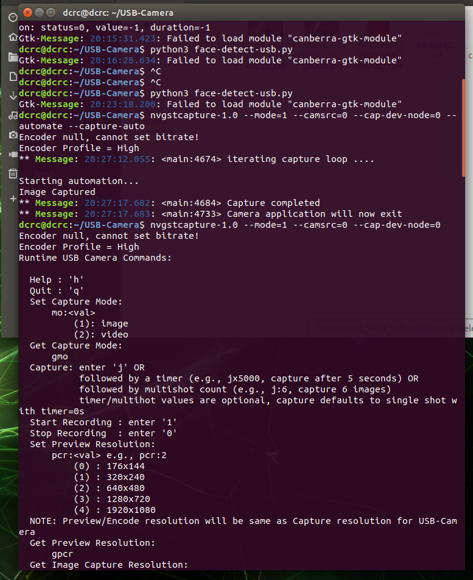
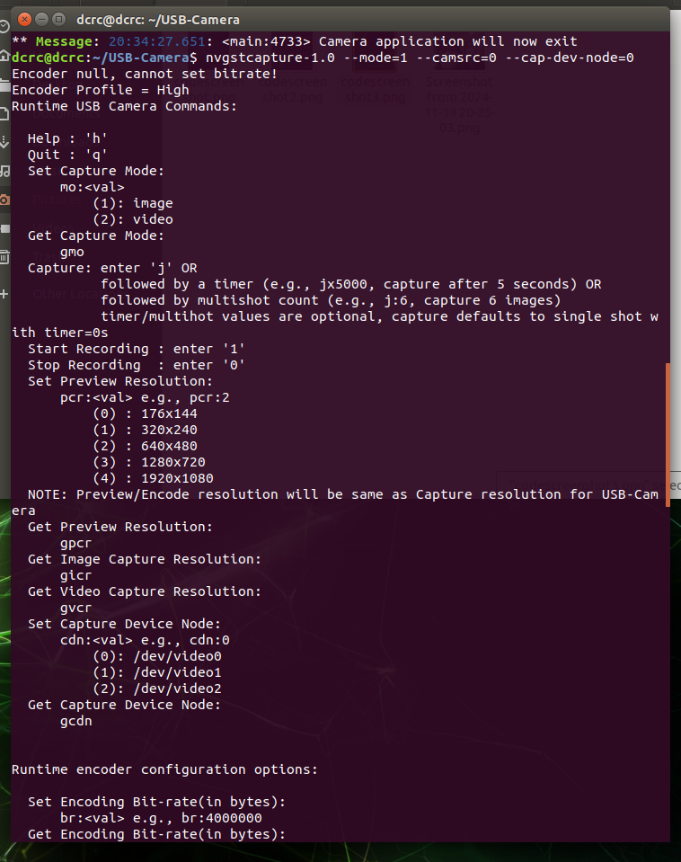

# Jetson_dli_PSY

``` bash
hello
<b>
# hello
## hello
### hello
```
1. SD card format download formatting 한다
2. flink를 적고 다운로드 jetack 다운로드
3. 발레나이저를 다운해서 이미지를 굽는다
4. jestson nano에 대한 설명넣기

5. USB 2층 가장 우측이 잘 작동되는 자리이다. 
6. 5V 4A인지 꼭 확인하고 jetson에 사용할것
7. jeston에 keyboard mouse, keyboard USB를 연결할 것
8. dkdkdkdkddkdkdk

'한글 설치'
``` bash
$ sudo apt-get update
$ sudo apt-get install fcitx-hangul
$ im-config -n fcitx
$ reboot
```







